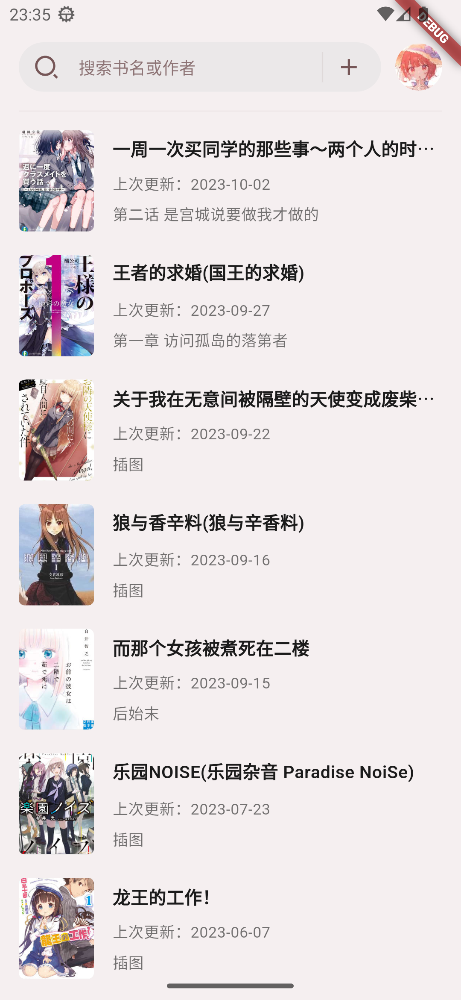
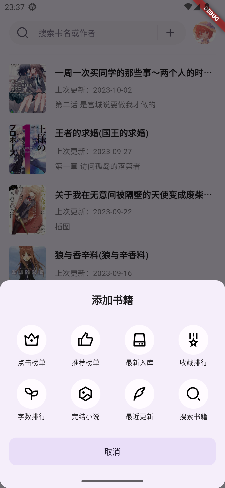
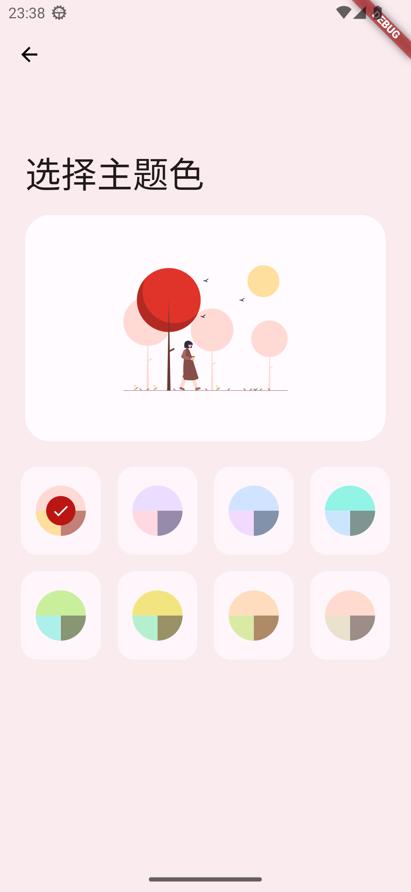
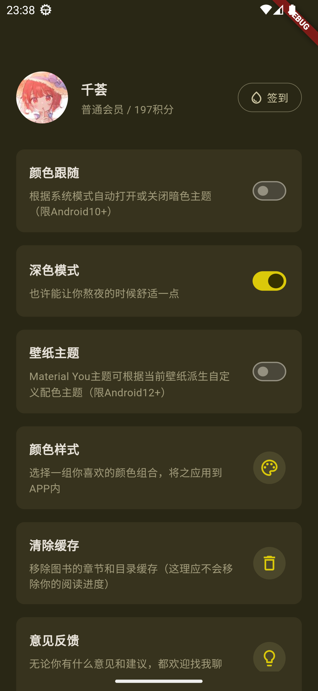
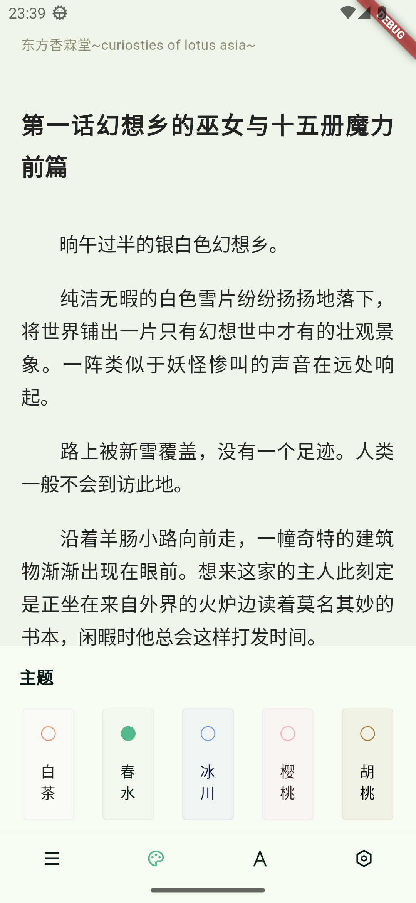
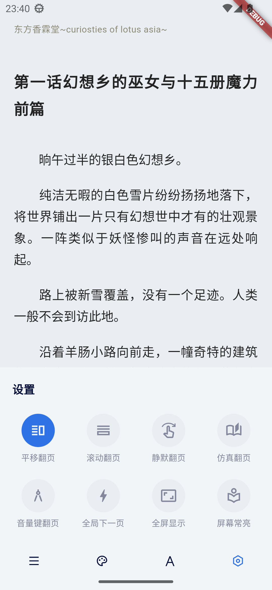
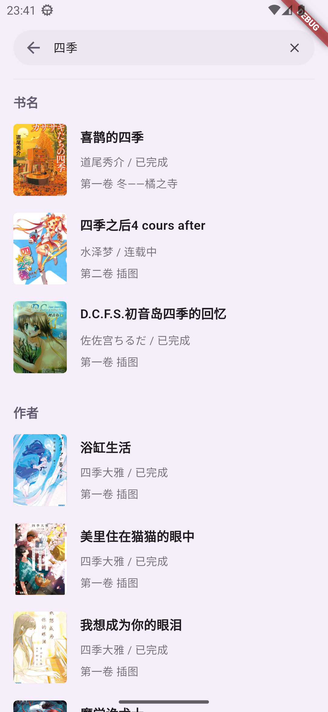
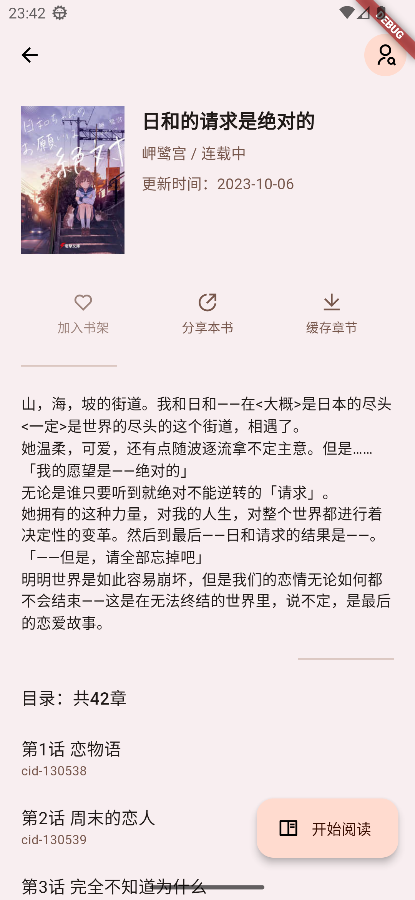
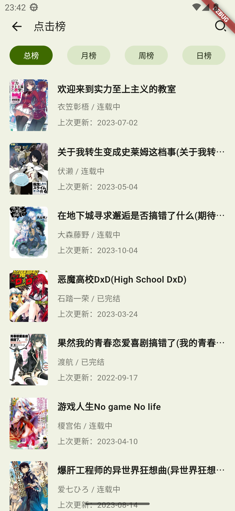
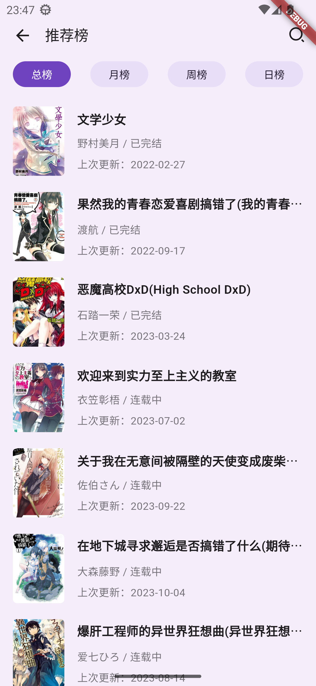

# wenku8x

基于 flutter 制作的第三方 `轻小说文库` 客户端.

## 功能实现

- [x] 账号登录（暂时仅支持用户名登入）
- [x] 书架获取
- [x] 排行榜
- [x] 搜索书籍和作者
- [x] 书籍详情
- [x] 图书阅读
- [x] 阅读主题
- [x] 阅读字体
- [x] 目录相关
- [-] 阅读设置（未完善）
- [x] 用户签到
- [x] 书籍缓存
- [x] 颜色跟随系统（低版本系统待适配）
- [x] Material You 配色（低版本系统待适配）
- [x] 主题色选取

## 截图

<div align=center>












</div>

## 运行与编译

> 当前平台信息：Channel stable, 3.13.6, on macOS 13.3.1

```shell
flutter pub get
flutter run // 运行
flutter build apk --release --target-platform=android-arm64 // 编译
```

### 平台支持情况

[x] Android13 —— 主要运行

[x] iPadOS17 —— 简单测试，大致可运行

[x] macOS13+ —— 简单测试，可运行

[ ] Linux —— 未测试，理论可运行

[ ] Windows —— 未测试，理论可运行

## 声明

- 此项目是个人为了兴趣而开发, 仅供学习交流使用, 无任何商业用途.
- 资源版权仍归原网站或其作者所有.
- 所用 API 皆从官方网站收集, 不含任何非法及破解内容.

## 感谢

- [light-novel-library_Wenku8_Android](https://github.com/MewX/light-novel-library_Wenku8_Android): 轻小说文库既有的公益客户端
